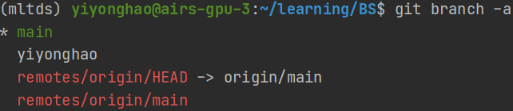

# BS

#### 介绍
SpringBoot + Vue + MySQL

#### 软件架构
软件架构说明


#### git使用说明

**分支情况**



main：主分支，连接远程主分支，**不能修改**，只能pull和push，

yiyonghao：开发人员分支，git commit上传到这个分支，使用该分支进行开发。

remotes/origin/HEAD -> origin/main，远程分支和本地最新仓库连接


**开发过程**

```shell
# 1. 创建本地新分支，并切换到该新分支
git checkout -b yiyonghao
# 若已经存在，则切换到该分支即可
git checkout yiyonghao

# 2. 开发过程。。。


# 3. 上传开发代码到本地开发人员分支
git add .
git commit -m "this is a message"

# 4. 切换主分支，先合并其他人上传的新代码
git checkout main
git pull --rebase

# 5. 合并本地开发分支和主分支，并上传新代码
git merge yiyonghao
git push
```


1.  xxxx


#### 参与贡献

1.  Fork 本仓库
2.  新建 Feat_xxx 分支
3.  提交代码
4.  新建 Pull Request


#### 特技

1.  使用 Readme\_XXX.md 来支持不同的语言，例如 Readme\_en.md, Readme\_zh.md
2.  Gitee 官方博客 [blog.gitee.com](https://blog.gitee.com)
3.  你可以 [https://gitee.com/explore](https://gitee.com/explore) 这个地址来了解 Gitee 上的优秀开源项目
4.  [GVP](https://gitee.com/gvp) 全称是 Gitee 最有价值开源项目，是综合评定出的优秀开源项目
5.  Gitee 官方提供的使用手册 [https://gitee.com/help](https://gitee.com/help)
6.  Gitee 封面人物是一档用来展示 Gitee 会员风采的栏目 [https://gitee.com/gitee-stars/](https://gitee.com/gitee-stars/)
