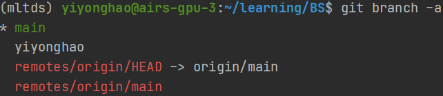
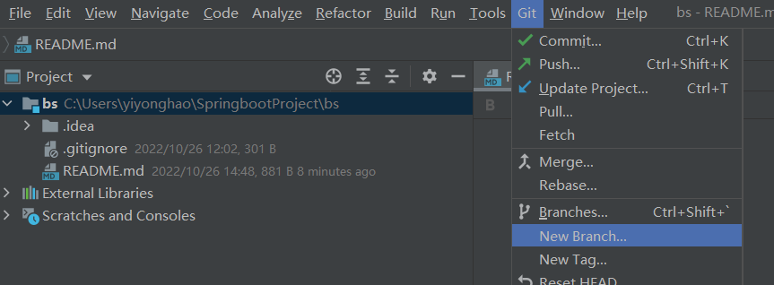
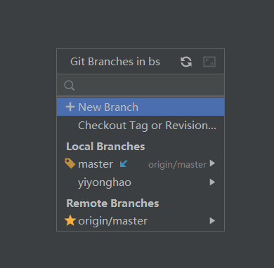
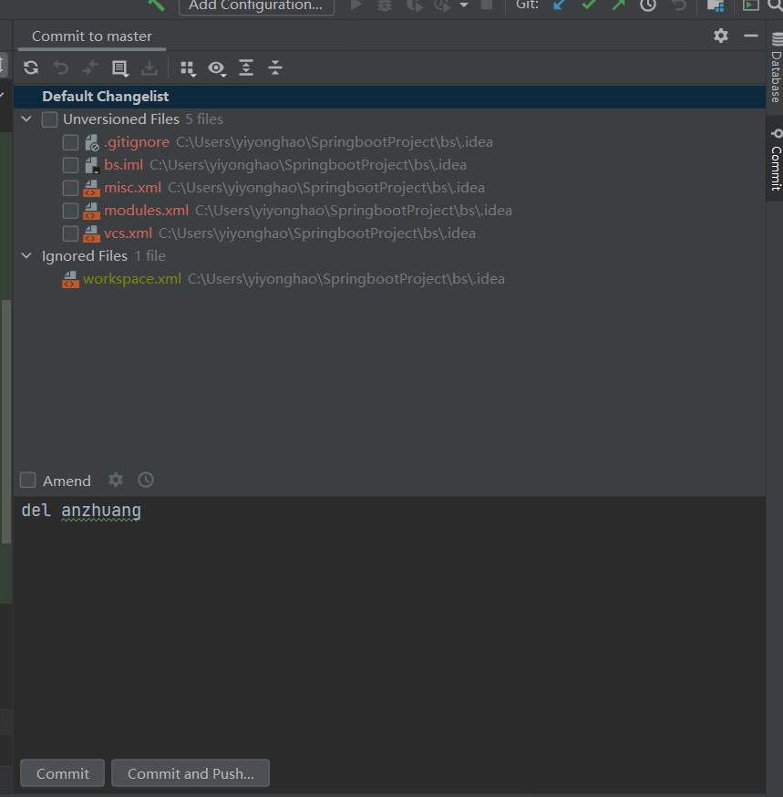
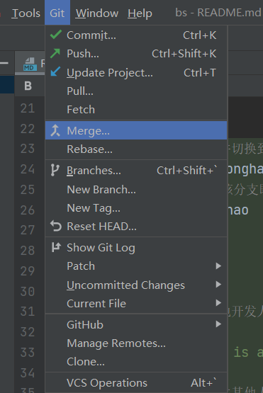
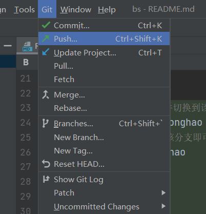
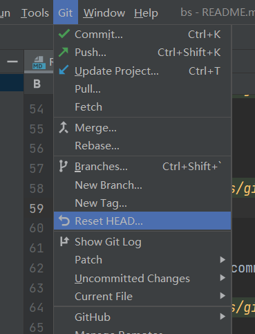
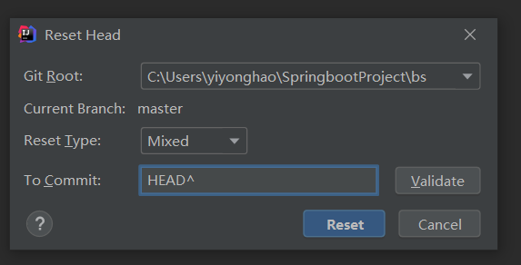

# 目标检测识别算法Web系统

## 介绍
SpringBoot + Vue + MySQL + RabbitMQ + Celery

# 部署说明

## 1. 数据库

MySQL - Mybatis, Mybatis-plus

**Docker 部署 MySQL**

```shell
# 拉取镜像
docker pull mysql:5.7

# 启动镜像(root)
docker run --restart=always -p 3306:3306 --name mysql-docker -v /etc/mysql/data:/var/lib/mysql -e MYSQL_ROOT_PASSWORD=xxxxx -d mysql:5.7

docker run --restart=always --name=mysql-docker -it -p 3306:3306 -v /opt/data/mysql/mysqld:/var/run/mysqld -v /opt/data/mysql/db:/var/lib/mysql -v /opt/data/mysql/conf:/etc/mysql/conf.d -v /opt/data/mysql/files:/var/lib/mysql-files -e MYSQL_ROOT_PASSWORD=xxxxxx --privileged=true -e TZ=Asia/Shanghai -d mysql:5.7
#  --privileged=true
# -p 端口映射，左边是宿主机端口，右边是容器端口
# /etc/mysql mysql的配置文件，不挂载也没问题
# /var/lib/mysql mysql配置的数据文件存放路径，建议挂载，不挂载也行
# -e MYSQL_ROOT_PASSWORD 初始化 root 用户的密码
# TZ 时区设置

# 设置 docker 时区
sudo docker cp /etc/localtime mysql-docker:/etc/localtime

# 进入容器
mysql -uroot -p --default-character-set=utf8 -h127.0.0.1


## 1.创建用户和赋权

#创建用户
create user aaaa@'localhost' identified by 'bbbb';
update mysql.user set Host='%' where User='aaaa' and Host='localhost';
#赋权
grant all privileges on *.* to aaaa@'%';

flush privileges;

## 2.删除用户和查看

#删除用户
DROP USER 'aaaa'@'%';
#查看用户
SELECT User, Host FROM mysql.user;

# 创建数据库并指定字符集
CREATE DATABASE mltds DEFAULT CHARACTER SET utf8 COLLATE utf8_general_ci;
#为某张表赋权限
grant all privileges on DbName.* to aaaa;


# 3.允许其他主机访问(远程连接权限)
GRANT ALL PRIVILEGES ON *.* TO 'xxxxx'@'%' IDENTIFIED BY 'xxxxx';	
# 执行失败尝试以下指令
GRANT ALL PRIVILEGES ON *.* TO 'xxxxx'@'%' IDENTIFIED BY 'xxxxx' WITH GRANT OPTION;
GRANT ALL PRIVILEGES ON *.* TO 'xxxxx'@'%' IDENTIFIED BY 'xxxxx' WITH GRANT OPTION;
# 一定要执行这个！！！
flush privileges;

```

添加依赖

```xml
        <!--        pom.xml     -->
        <!--        mybatis     -->
        <dependency>
            <groupId>org.mybatis.spring.boot</groupId>
            <artifactId>mybatis-spring-boot-starter</artifactId>
            <version>2.2.2</version>
        </dependency>
        <!--        mybatis-plus-->
        <dependency>
            <groupId>com.baomidou</groupId>
            <artifactId>mybatis-plus-boot-starter</artifactId>
            <version>3.5.1</version>
        </dependency>
```

## 2. 代码生成器

添加依赖

```xml
<!--        代码生成器-->
<dependency>
    <groupId>com.baomidou</groupId>
    <artifactId>mybatis-plus-generator</artifactId>
    <version>3.5.1</version>
</dependency>
<dependency>
    <groupId>org.apache.velocity</groupId>
    <artifactId>velocity</artifactId>
    <version>1.7</version>
</dependency>
```

在项目目录下新建utils/CodeGenerator类，并对数据库和包名进行配置

```java
public class CodeGenerator {
    private static void generator() {
        FastAutoGenerator.create("jdbc:mysql://localhost:3306/test?serverTimezone=GMT%2b8", "root", "P@ss123.")
                .globalConfig(builder -> {
                    builder.author("qingxi") // 设置作者
//                            .enableSwagger() // 开启 swagger 模式
                            .fileOverride() // 覆盖已生成文件
                            .outputDir("/Users/qingxi/Code/qingxi/springboot/boot-mybatis/src/main/java/"); // 指定输出目录
                })
                .packageConfig(builder -> {
                    builder.parent("com.example.bootmybatis") // 设置父包名
                            .moduleName("") // 设置父包模块名
                            .pathInfo(Collections.singletonMap(OutputFile.mapperXml, "/Users/qingxi/Code/qingxi/springboot/boot-mybatis/src/main/resources/mapper/")); // 设置mapperXml生成路径
                })
                .strategyConfig(builder -> {
                    builder.entityBuilder().enableLombok();
                    builder.mapperBuilder().enableMapperAnnotation().build();
                    builder.controllerBuilder().enableHyphenStyle()  // 开启驼峰转连字符
                            .enableRestStyle();  // 开启生成@RestController 控制器
                    builder.addInclude("t_user") // 设置需要生成的表名
                            .addTablePrefix("t_"); // 设置过滤表前缀
                })
//                .templateEngine(new FreemarkerTemplateEngine()) // 使用Freemarker引擎模板，默认的是Velocity引擎模板
                .execute();
    }
    public static void main(String[] args) {

    }
}
```

参考地址：*https://baomidou.com/pages/bab2db/#spring*

## 3. Rabbimq

**Docker部署rabbitmq**

**Docker拉取镜像**

https://blog.csdn.net/weixin_39617052/article/details/79723849


```shell
docker pull rabbitmq:management

docker run -d --restart=always -e RABBITMQ_DEFAULT_USER=xxxxxx -e RABBITMQ_DEFAULT_PASS=xxxxxx -p 15672:15672 -p 5672:5672 -p 25672:25672 rabbitmq:management
# 15672是控制台端口号，5672是应用访问端口号
# -p xxx:yyy 将容器的yyy端口映射到宿主机的xxx端口上
docker exec -it 27fac58b7d9a /bin/bash
# 添加用户
rabbitmqctl add_user xxxxx xxxxxx
# 设置用户管理员权限
rabbitmqctl set_user_tags xxxxxx administrator
# 添加虚拟主机
rabbitmqctl add_vhost vhost
# 授权虚拟host用户访问权限
rabbitmqctl set_permissions -p vhost xxxxxx ".*" ".*" ".*" 
```

访问http://xx.xxx.xxx.xxx:15672

**修改配置文件，设置账号和密码**

*com.learning.mltds.utils.rabbitmq.ConnectionUtil*

**添加依赖库**

```xml
        <!-- rabbitmq -->
        <dependency>
            <groupId>org.springframework.boot</groupId>
            <artifactId>spring-boot-starter-amqp</artifactId>
        </dependency>
        <!--   解析json     -->
        <dependency>
            <groupId>com.alibaba</groupId>
            <artifactId>fastjson</artifactId>
            <version>1.2.46</version>
        </dependency>
```

**参考文章**

[(61条消息) Docker 安装 RabbitMQ 并安装延迟队列插件 rabbitmq-delayed-message-exchange_沉默星河的博客-CSDN博客](https://blog.csdn.net/m0_46114643/article/details/124692659)


## 4. GDAL（Java8, Windows10）

*com.learning.mltds.utils.geoserver.TiffDataset*

**下载动态资源文件（zip）并解压**

[GISInternals Support Site](https://www.gisinternals.com/query.html?content=filelist&file=release-1900-x64-gdal-3-0-2-mapserver-7-4-2.zip)

**配置gdal库的api接口**

将 *xxx\gdal\bin\gdal\java* 下的gdal.jar包复制到项目目录下，在IDEA中打开springboot项目，打开 *File-Project Structure*

在 *Project Setting-Modules* 中选择项目的 *Dependencies* 添加gdal.jar。

**配置实现函数的dll文件**

将 *xxx\gdal\bin* 下的所有 *.dll* 文件，以及 *xxx\gdal\bin\gdal\java* 下的 *gdalalljni.dll* 文件复制到项目项目使用的JDK文件夹 *\\.jdks\corretto-1.8.0_342\jre\bin* 目录中。


**配置环境变量**

将上述的

- gdal\bin，
- gdal\bin\gdal\java，

目录加入系统环境变量的Path中。

将proj *gdal\bin\proj6\share* 加入环境变量，添加名称 PROJ_LIB

！！！修改系统环境变量后一定要重启！！！


**参考方案**

[(68条消息) JAVA使用GDAL编译后dll动态库_晟誉小宝贝的博客-CSDN博客_java 编译dll](https://blog.csdn.net/qq_29101355/article/details/126574541)

[(68条消息) 【GDAL】 java环境配置---第一篇_GAMESLI-GIS的博客-CSDN博客_gdal java](https://blog.csdn.net/qq_22849251/article/details/118051924?spm=1001.2101.3001.6650.1&utm_medium=distribute.pc_relevant.none-task-blog-2~default~BlogCommendFromBaidu~Rate-1-118051924-blog-126574541.pc_relevant_recovery_v2&depth_1-utm_source=distribute.pc_relevant.none-task-blog-2~default~BlogCommendFromBaidu~Rate-1-118051924-blog-126574541.pc_relevant_recovery_v2&utm_relevant_index=2)


## 5. JAMA

java处理矩阵运算的库，在本项目中用于解非齐次线性线性方程组

**安装和使用**

添加pom.xml依赖

```xml
		<!-- java matrix 计算库       -->
        <!-- https://mvnrepository.com/artifact/gov.nist.math/jama -->
        <dependency>
            <groupId>gov.nist.math</groupId>
            <artifactId>jama</artifactId>
            <version>1.0.3</version>
        </dependency>
```

**参考文章**

http://t.csdn.cn/BFa5L


# 开发使用说明

## git使用说明

**分支情况**



main：主分支，连接远程主分支，**不能修改**，只能pull和push，

yiyonghao：开发人员分支，git commit上传到这个分支，使用该分支进行开发。

remotes/origin/HEAD -> origin/main，远程分支和本地最新仓库连接


**开发过程**

```shell
# 1. 创建本地新分支，并切换到该新分支
git checkout -b yiyonghao
# 若已经存在，则切换到该分支即可
git checkout yiyonghao

# 2. 开发过程。。。


# 3. 上传开发代码到本地开发人员分支
git add .
git commit -m "this is a message"

# 4. 切换主分支，!!!先合并其他人上传的新代码!!!!
git checkout main
git pull --rebase

# 5. 合并本地开发分支和主分支，并上传新代码
git merge yiyonghao
git push
```

## IDEA 开发使用Git

参考文档：
- https://blog.csdn.net/jdsaiasodh/article/details/124667680
- https://blog.csdn.net/weixin_43252521/article/details/123959391


 **1.1 创建本地新分支** 




 **1.2 切换分支** 



 **2. commit新代码** 

选择commit的文件，填写commit message，并点击commit， **不要点击commit & push** 。



 **3. 合并主分支和本地开发分支** 

！！！合并之前注意检查，主分支是否与远程分支同步！！！

选择开发分支



 **4. push** 



 **5. reset**
若忘记同步远程代码就merge新的修改代码，且未push到远程，可以使用reset，使用```HEAD^```表示回退到上一个版本。

 



在回退后使用pull合并远程后，再merge。


## 开发记录

### Backend

|  前端请求路径  | 进度 |                       备注                        |
| :------------: | :--: | :-----------------------------------------------: |
|  user/login/   | Done |                缺少对session的处理                |
|  user/logout/  | Done |                缺少对session的处理                |
| user/register/ | Done | 缺少对session的处理，缺少返回注册成功的id号的逻辑 |
|   file-menu/   | Done |                                                   |
|                |      |                                                   |
|                |      |                                                   |


#### 参与贡献

1.  Fork 本仓库
2.  新建 Feat_xxx 分支
3.  提交代码
4.  新建 Pull Request


#### 特技

1.  使用 Readme\_XXX.md 来支持不同的语言，例如 Readme\_en.md, Readme\_zh.md
2.  Gitee 官方博客 [blog.gitee.com](https://blog.gitee.com)
3.  你可以 [https://gitee.com/explore](https://gitee.com/explore) 这个地址来了解 Gitee 上的优秀开源项目
4.  [GVP](https://gitee.com/gvp) 全称是 Gitee 最有价值开源项目，是综合评定出的优秀开源项目
5.  Gitee 官方提供的使用手册 [https://gitee.com/help](https://gitee.com/help)
6.  Gitee 封面人物是一档用来展示 Gitee 会员风采的栏目 [https://gitee.com/gitee-stars/](https://gitee.com/gitee-stars/)
